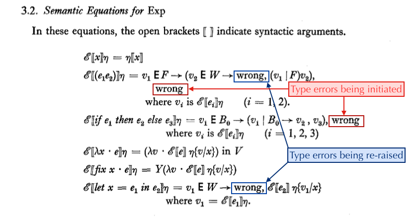

# Types and Polymorphism chapter 3

## Recap

1. Introduction
2. Illustrations of the Type Discipline
3. A Simple Applicative Language and its Types
  * The Semantic Soundness theorem
4. A Well-Typing Algorithm and its Correctness
  * Algorithm W
  * The Syntactic Soundness theorem
  * Algorithm J
5. Types in Extended Languages

## Section 3

Section 3 has subsections:

1. The Language Exp
2. Semantic Equations for Exp
3. Discussion of Types
4. Types and their Semantics
5. Type Assignments
6. Substitutions
7. Well-Typed Expressions Do Not Go Wrong

Our purpose in this section is to prove the Semantic Soundness Theorem,
which says that:
  * If we can assign a type to an expression
  * Then the runtime will never throw a type error at runtime

Two main things can go wrong with this.
  1. Runtime E, which throws type errors when it feels like it;
  2. Type system Z, where everything has type Zoidberg.

So we will have to firm up the statement of the theorem by
  1. stating what conditions the runtime can have for throwing a type error;
  2. strengthening the conditions for assigning a type to an expression.

## 3.1 The Language Exp (p.356)

* The AST for our language
* The objects our language can operate on (booleans, numbers, strings, functions, arrays, and so on)
  - Booleans and functions are treated specially, as is W, the "Wrong" type.
* The environment type.

## 3.2 Semantic Equations for Exp (p.358)

* Defines the runtime evaluator for our language. This is a standard evaluator, but the important
  parts are where it returns `wrong`. These are the type errors:
  * If you call something, it has to be a Function
  * The condition of an `if-then-else` must be a Boolean.

* Three quick points:
  * `fix` is defined in terms of the Y combinator
  * Semantically, `let x = 3 in x+1` is the same as `(lambda (x) x+1)(3)`.
    But we agreed last week that as far as *typing* goes, we are going to
    treat them differently.
  * Our language is call-by-value, but call-by-name is very similar as far as evaluation
    is concerned, and more importantly, completely identical to the type checker.

## 3.3 Discussion of Types (p.359)

Values usually have types.
* Some values have one type, e.g., `1` has type `Int`.
* Some values have many types, e.g., `length` has types `[Int]->Int` and `[String]->Int`
* Some values have no type, e.g., `if 3 then 4 else 5`
* If a function has type `a -> b`, and we give it value of type `a`, then we will get out
  a value of type `b`, not an error.

We now have 2 goals:
* Prove that if we can assign a type to an expression and it is "well-typed"
  (which we will define in 3.5), the evaluator won't throw a type error at
  runtime.  This is the remainder of section 3,
* Find a way to assign a type to an expression - this is section 4.

## 3.4 Types and their Semantics (p.359)

Syntax of types:
* Basic types
* Type variables
* Construction of function types from basic types and type variables

Semantics of monotypes: a value has a monotype if:
* It's a basic type, then the type of the value is the type of the object
* It's a function that always returns a type `b` when given a type `a`, then it has type `a->b`
  * Another example of a function with no type: f(1) = "one", f(2) = 2, f undefined elsewhere

Semantics of polytypes
* <=

Notes on "downward closed" and "directed complete":
* These mostly come from Dana Scott's domain theory
* Directed Complete (aka "up complete" aka "DCPO") means that every directed subset has a supremum
  * and in this case, it means that 

## 3.5 Type Assignments (p.361)

This important section is where we define well-typed. The paper actually
defines it twice, and the second definition (Proposition 3) is easier to work
with.

## 3.6 Substitutions (p.363)
## 3.7 Well-Typed Expressions Do Not Go Wrong (p.364)

# Types and Polymorphism chapter 3

## Recap

1. Introduction
2. Illustrations of the Type Discipline
3. A Simple Applicative Language and its Types
  * The Semantic Soundness theorem
4. A Well-Typing Algorithm and its Correctness
  * Algorithm W
  * The Syntactic Soundness theorem
  * Algorithm J
5. Types in Extended Languages

## Section 3

Section 3 has subsections:

1. The Language Exp
2. Semantic Equations for Exp
3. Discussion of Types
4. Types and their Semantics
5. Type Assignments
6. Substitutions
7. Well-Typed Expressions Do Not Go Wrong

Our purpose in this section is to prove the Semantic Soundness Theorem,
which says that:
  * If we can assign a type to an expression
  * Then the runtime will never throw a type error at runtime

Two main things can go wrong with this.
  1. Runtime E, which throws type errors when it feels like it;
  2. Type system Z, where everything has type Zoidberg.

So we will have to firm up the statement of the theorem by
  1. stating what conditions the runtime can have for throwing a type error;
  2. strengthening the conditions for assigning a type to an expression.

## 3.1 The Language Exp (p.356)

* The AST for our language
* The objects our language can operate on (booleans, numbers, strings, functions, arrays, and so on)
  - Booleans and functions are treated specially, as is W, the "Wrong" type.
* The environment type.

## 3.2 Semantic Equations for Exp (p.358)

* Defines the runtime evaluator for our language
* Three quick points:
  * `fix` is defined in terms of the Y combinator
  * Semantically, `let x = 3 in x+1` is the same as `(lambda (x) x+1)(3)`.
    But we agreed last week that as far as *typing* goes, we are going to
    treat them differently.
  * Our language is call-by-value, but call-by-name is very similar as far as evaluation
    is concerned, and more importantly, completely identical to the type checker.

## 3.3 Discussion of Types (p.359)

* Values usually have types.
  * Some values have one type, e.g., `1` has type `Int`.
  * Some values have many types, e.g., `length` has types `[Int]->Int` and `[String]->Int`
  * Some values have no type, e.g., `if 3 then 4 else 5`
  * If a function has type `a -> b`, and we give it value of type `a`, then we will get out
    a value of type `b`, not an error.
* We are going to define the concept "Well-typed"
* We now have 2 goals:
  * Prove that if we can assign a type to an expression, it won't throw a type error at runtime.
    This is the remainder of section 3,
  * Find a way to assign a type to an expression - this is section 4.

## 3.4 Types and their Semantics (p.359)

* Syntax of types
  * Basic types
  * Type variables
  * Construction of function types from basic types and type variables
* Semantics of monotypes: a value has a monotype if:
  * It's a basic type, then the type of the value is the type of the object
  * It's a function that always returns a type `b` when given a type `a`, then it has type `a->b`
    * Another example of a function with no type: f(1) = "one", f(2) = 2, f undefined elsewhere
* Semantics of polytypes

## 3.5 Type Assignments (p.361)
## 3.6 Substitutions (p.363)
## 3.7 Well-Typed Expressions Do Not Go Wrong (p.364)
